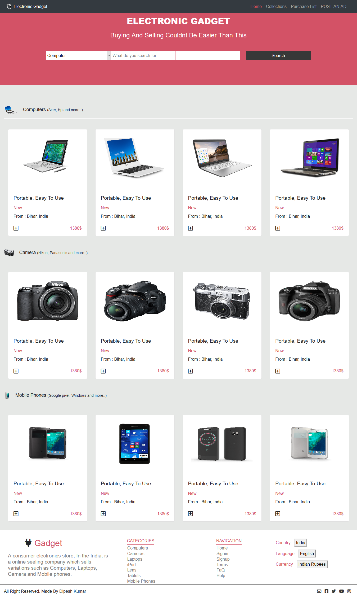
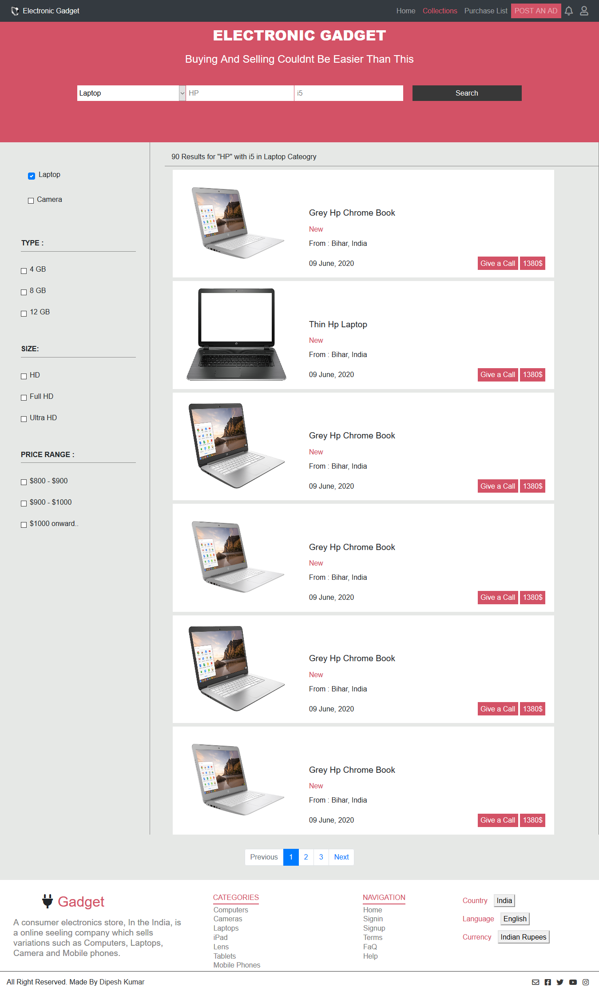

# Electronic_gadget
This project is the HTML &amp; CSS Capstone Project which is based on an online shop for electronics. It resembles the real-life project.

## Project Design

### Home Page

Project Design Screenshot : 

### Search Page

Project Design Screenshot : 


## Built With

- HTML5
- CSS3
- Bootstrap 4
- Font Awesome icon
- Media Queries

## Website Design

[ZATTIX](https://www.behance.net/gallery/24796463/ZATTIX)

## Live Demo

[Live Demo Link](https://raw.githack.com/Dipeshtwis/electronic_gadget/feature-gadget/index.html)


# Github link:

For the: [Github-link](https://github.com/Dipeshtwis/electronic_gadget/tree/feature-gadget)

# Getting Started 🚀

These instructions will get you a copy of the project up and running on your local machine.

## How To Use 🔧

From your command line, first clone the project:

```bash
# Clone this repository
$ git clone https://github.com/Dipeshtwis/electronic_gadget.git

# Go into the repository
$ cd electronic_gadget

```

## CONTRIBUTOR

👤 **Dipesh Kumar**

- [Github](@Dipeshtwis)
- [Twitter](@97deepeshkumar)
- [Linkedin](https://www.linkedin.com/in/dipesh-kumar-b6ab88134/)


## Show your support

Give a ⭐️ if you like this project!

## Acknowledgments

- Thanks to Microverse and The Odin Project.

